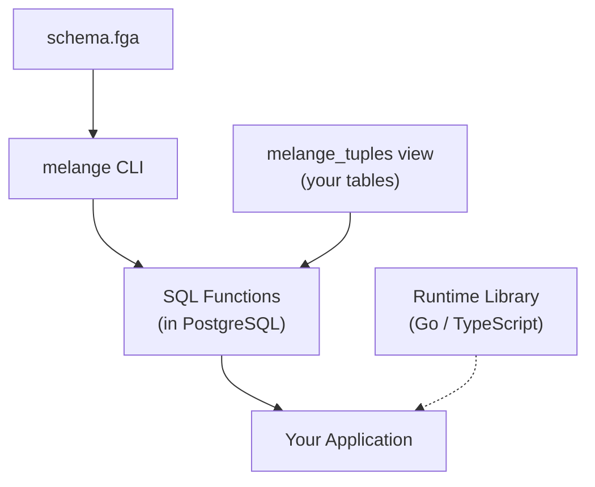

Melange has four components. The CLI and a schema file are required. The tuples view is created by you in your database. The runtime libraries are optional.



## CLI (Compiler)

The `melange` CLI is the compiler. It reads your `.fga` schema, analyzes each relation, and generates specialized PostgreSQL functions. Each type+relation pair gets its own check function, plus dispatchers (`check_permission`, `list_accessible_objects`, `list_accessible_subjects`) that route calls to the correct function.

The CLI also handles validation, health checks, and code generation:

```bash
melange validate              # Check schema syntax
melange migrate               # Compile schema and install SQL functions
melange doctor                # Verify everything is wired up correctly
melange generate client       # Generate type-safe client code
melange generate migration    # Produce versioned .sql files for external frameworks
```

The compilation happens at migration time, not at runtime. Once the functions are installed, the CLI is not involved in permission checks.

- [Installation](../../getting-started/installation/)
- [CLI Reference](../../reference/cli/)

## Schema (Authorization Model)

The schema defines your authorization model using the [OpenFGA DSL](https://openfga.dev/docs/configuration-language). It declares types, relations, and the rules that connect them.

```fga
model
  schema 1.1

type user

type organization
  relations
    define owner: [user]
    define admin: [user] or owner
    define member: [user] or admin

type repository
  relations
    define org: [organization]
    define owner: [user]
    define can_read: member from org or owner
    define can_write: owner
```

This schema is the input to the compiler. Each `define` statement produces a specialized SQL function. Role hierarchies (`admin: [user] or owner`) are resolved at compile time through transitive closure computation, so runtime checks avoid graph traversal.

The schema file is typically stored at `melange/schema.fga` in your project.

- [Authorization Modelling](../modelling/)
- [How It Works](../how-it-works/)

## melange_tuples View

The `melange_tuples` view is a SQL view you create over your existing domain tables. It maps your data into the tuple format (`subject_type`, `subject_id`, `relation`, `object_type`, `object_id`) that the generated functions query.

```sql
CREATE OR REPLACE VIEW melange_tuples AS
SELECT
    'user' AS subject_type,
    user_id::text AS subject_id,
    role AS relation,
    'organization' AS object_type,
    organization_id::text AS object_id
FROM organization_members

UNION ALL

SELECT
    'organization' AS subject_type,
    organization_id::text AS subject_id,
    'org' AS relation,
    'repository' AS object_type,
    id::text AS object_id
FROM repositories;
```

This is the relationship graph. The generated SQL functions query this view to resolve permissions. Because it's a view over your tables (not a separate store), permissions are always in sync with your data and permission checks within a transaction see uncommitted changes.

You construct this view. Melange does not create or manage it.

- [Creating Your Tuples View](../../getting-started/tuples-view/): step-by-step setup
- [Tuples View](../tuples-view/): schema reference, indexing, and optimization

## Runtime Libraries (Optional)

The generated SQL functions are callable from any language via standard PostgreSQL queries. The runtime libraries provide a typed Go or TypeScript API on top of those functions.

**Without a runtime library** (any language):

```sql
SELECT check_permission('user', 'alice', 'can_read', 'repository', '42');
```

**With the Go runtime library**:

```go
checker := melange.NewChecker(db)
allowed, err := checker.Check(ctx, user, "can_read", repo)
```

The runtime library adds:

- **Caching**. In-memory cache with configurable TTL (~83ns cached vs ~422μs uncached).
- **Bulk checks**. Check up to 10,000 permissions in a single SQL call.
- **Contextual tuples**. Inject temporary tuples at check time for request-scoped authorization data.
- **Decision overrides**. Bypass the database for testing or admin tools.
- **List operations**. Paginated listing of accessible objects or subjects.
- **Error mapping**. PostgreSQL errors mapped to typed Go/TypeScript errors.

**Type generation** (`melange generate client`) produces constants and constructors from your schema, adding compile-time safety:

```go
import "myapp/internal/authz"

allowed, err := checker.Check(ctx,
    authz.User("alice"),       // type-safe constructor
    authz.RelCanRead,          // generated constant
    authz.Repository("42"),
)
```

The runtime libraries are optional. If your stack doesn't use Go or TypeScript, use the SQL functions directly from any PostgreSQL client.

- [Go API](../../reference/go-api/)
- [TypeScript API](../../reference/typescript-api/)
- [SQL API](../../reference/sql-api/)
- [Generated Code](../../reference/generated-code/)

## Next Steps

- [Quick Start](../../getting-started/quick-start/): all four components working together in 5 minutes
- [How It Works](../how-it-works/): the compilation pipeline in detail
